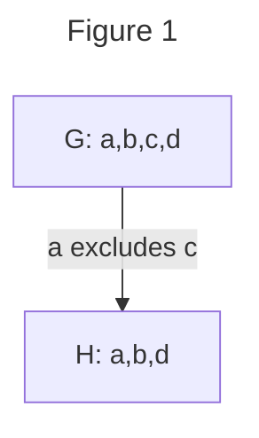
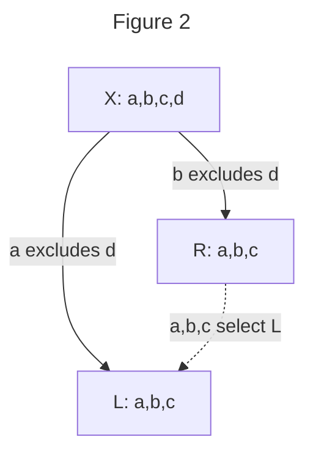
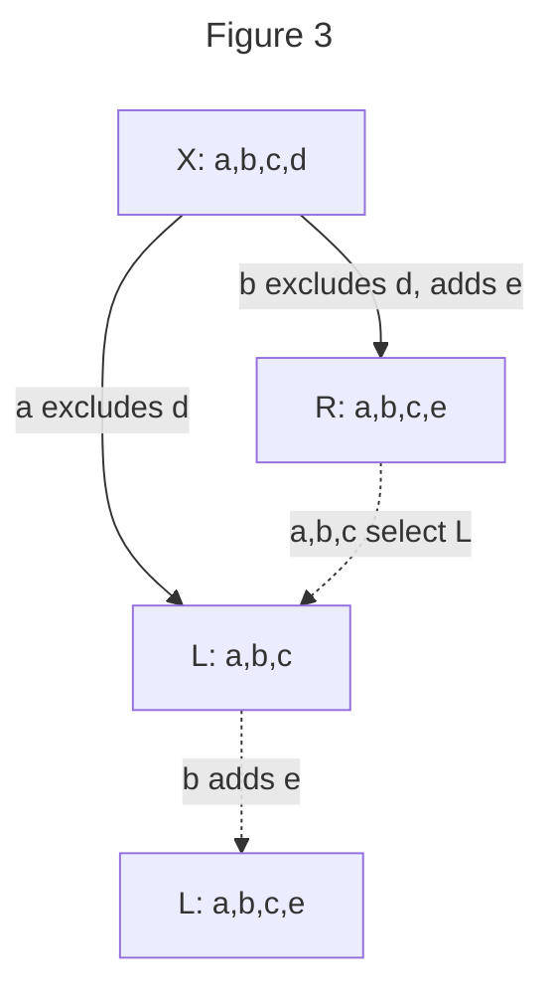
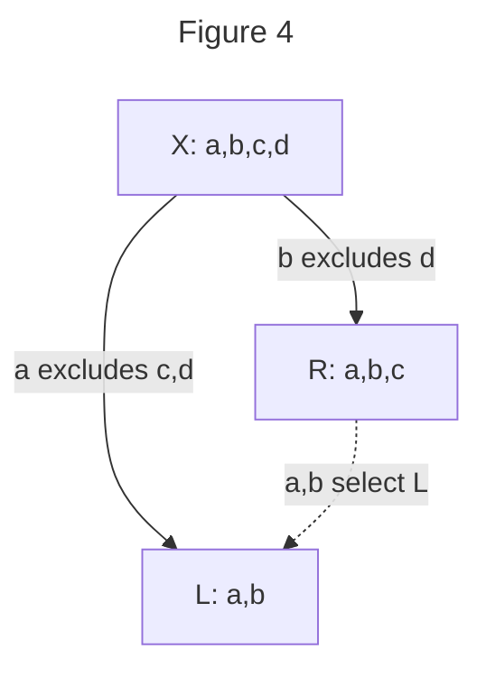
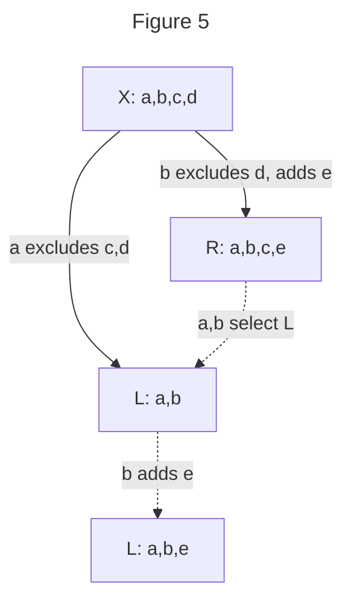
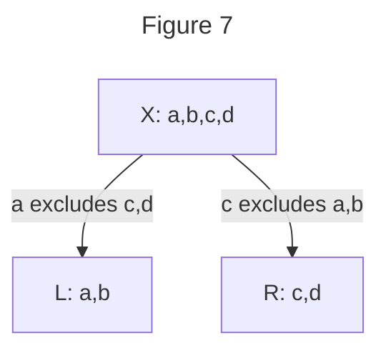
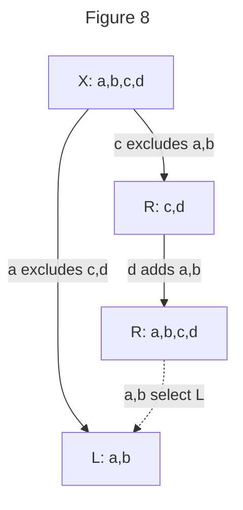

<!--
SPDX-FileCopyrightText: 2023 Andre 'Staltz' Medeiros <contact@staltz.com>

SPDX-License-Identifier: CC-BY-4.0
-->

# ssb-group-exclusion-spec

Version: 0.0

Authors: Mix Irving <mix@protozoa.nz>, Andre Staltz <contact@staltz.com>

License: This work is licensed under a Creative Commons Attribution 4.0
International License.


## Abstract

In this document, we describe how SSB private groups can create the illusion of
group member removal by cycling the symmetric keys in "epochs", thus effectively
excluding a peer from participation in the new epochs.  We also address how to
resolve various cases of diverging epochs, such that group members follow rules
that arrive to consensus on which epoch must new content be published on.


## 1. Introduction

Private groups in SSB are contexts where a set of peers (called "group members"
or "members") use the same symmetric encryption key (called "group key") to
share content with each other privately.  Although adding a peer to the set is a
simple matter of forwarding the symmetric encryption key, removing a peer is
impossible under the assumptions we operate with.

The naive solution to this problem is for some group member to create a new
group key (called the "epoch key") and to share it with all the existing members
except with the undesired member(s).  From this point onwards, all
remaining members who have received the epoch key will proceed to encrypt new
content using the epoch key, effectively excluding the undesired member(s) from
decrypting that.  This is why we call this procedure "group member exclusion",
preventing them from entering new epochs, not "group member removal".  This has
the downside of requiring `O(remaining members)` direct messages to be
published, but is otherwise good for its simplicity.  We assume that member
exclusion is not as frequently occurring as member addition, so the downside is
a reasonable cost to pay.

Since SSB is an eventually consistent network where peers may have different
views on the current state of data structures, the naive solution can give rise
to multiple epochs.  This is undesired, because the goal of private groups is to
create a single context, not multiple contexts, where the set of peers can
participate in.  This document describes a few rules to resolve cases of
diverging epochs, with the goal of allowing remaining group members to
deterministically arrive at a single epoch, given eventual consistency of
propagated SSB messages.


## 2. Terminology

The key words "MUST", "MUST NOT", "REQUIRED", "SHALL", "SHALL NOT", "SHOULD",
"SHOULD NOT", "RECOMMENDED", "MAY", and "OPTIONAL" in this document are to be
interpreted as described in [RFC 2119](https://tools.ietf.org/html/rfc2119).


## 3. Definitions and notations

A set of SSB peers that possess the same [envelope-spec] symmetric encryption
key (called "group key") is called a "private group".  Each peer in a group is
called a "group member" or "member".  The "declared members" of a group is
the set of SSB peers who received the group key via `group/add-member` messages.

We also denote the declared members of a group `G` as the mathematical set
`members(G)`.

When a new group key is created and shared to a subset of members excluding some
other members, that group key is called an "epoch key", and the private group is
called an "epoch".  The act of creating an epoch is called "group member
exclusion" or "exclusion".  The group members who receive the "epoch key" are
called "remaining members".

We say that the original group (say `G`) "directly preceded" the epoch (say
`H`), and `H` "directly succeeded" `G`.  There may be a new epoch `I` excluding
a member from `H`, in which case the `I` directly succeeded `H` but `I`
"succeeded" `G`.  Similarly, `G` "preceded" `I`.  A sequence of epochs up until
the original group is called a "precedence chain".

Whenever there are two epochs such that one of them is not preceded by the
other, and both of them are not succeeded by any epoch, we call this situation
"forked epochs".  A "common predecessor" of two epochs `G` and `H` is any group
or epoch `X` that precedes (or is equal to) `G` and `H`.  The "nearest common
predecessor" `X` of epochs `G` and `H` is the only common predecessor of `G`
and `H` such that no other common predecessor `Y` (of `G` and `H`) succeeds `X`.
We also denote it as `X = nearest(G, H)`.

In a situation of forked epochs `G` and `H`, assume that `X` is the nearest
common predecessor.  We say that the "common members" of epoch `G` with respect
to `H` is the intersection of the declared members of `G` with the declared
members of `X`.

Some mathematical set relations will be useful throughout this specification.
We shall denote:

* The equivalence of two sets `A` and `B` as `A = B`
* The intersection as `A ∩ B`
* The union as `A ∪ B`
* The set difference as `A \ B`
* The symmetric difference as `A △ B`
* The subset relation as `A ⊆ B`
* The proper subset relation as `A ⊂ B`

For instance, the common members of `G` with respect to `H` can be denoted as:

```
common(G,H) = members(G) ∩ members(nearest(G,H))
```


## 4. Functional Specification

Exclusion of a group member is a mechanism in which a new epoch is created, such
that the excluded member is allowed to continue publishing messages for the
original group.  However, the excluded member's messages have no guarantee of
being replicated by remaining members, because those remaining members have
transitioned to the new epoch and ceased replication of the former group.  This
in effect only excludes the excluded member from participating in *future* group
discussions.

Creation of epochs is not restricted to any specific member and, in the presence
of network partitions, this allows multiple new epochs created by different
group members.  While the original group guaranteed a singleton context, when
there are multiple epochs there are multiple contexts where discussions can be
held, which is an undesirable property, i.e. forked epochs.  In this section we
provide some rules that remaining group members can follow to "resolve" forked
epochs and arrive at a common epoch as the new singleton context.


### 4.1. Excluding a group member

Suppose there is a private group or epoch `G`.  To exclude a group member `c`,
some group member `a` (`a` is not `c`) publishes the root message of a new epoch
`H` with pointers to `G`, and then publishes SSB message(s) encrypted to the
remaining members (all group `G` declared members except `c`), announcing the
epoch key and other epoch metadata. See figure 1 as an example.



To achieve this, member `a`:

* 4.1.1. MUST create a new symmetric group key (also known as the epoch key)
which MUST have at least 32 bytes of cryptographically secure random data
* 4.1.2. MUST create a new group feed (also known as the "epoch feed") using the
epoch key, as described in [ssb-meta-feeds-group-spec] Section 3.2
* 4.1.3. MUST publish a `group/init` message on the epoch feed for `H`, as
described in the [private-group-spec], with the exception that:
  * 4.1.3.A. the `tangles.group.previous` field MUST be the group `G`'s ID, and
  * 4.1.3.B. if `G` is also an epoch of another group, `tangles.group.root` MUST
  be the group ID for the first group (which is not an epoch of any other in
  this chain of epochs), otherwise
  * 4.1.3.C. if `G` is not an epoch of any other group, `tangles.group.root`
  MUST be group `G`'s ID
* 4.1.4. SHOULD publish a `group/exclude` message on their group feed for `G`
that points to `c`'s group feed for `G`. :fire: TODO more details
* 4.1.5. MUST publish a `group/add-member` message on their group feed for `G`,
to add remaining group members (this includes `a`, for recovery purposes) to the
epoch, such that the message schema is the same as the one in
[ssb-meta-feeds-group-spec] Section 3.1
  * 4.1.5.A. If a single SSB message cannot, due to message size
  restrictions, contain all remaining members as recipients, then member `a`
  MUST publish on their group feed for `G` a sequence of `group/add-members`
  according to [ssb-meta-feeds-group-spec] Section 3.1, such that the union of
  all recipients in that sequence equals all remaining group members


Concerning replication of group feeds, all remaining group members SHOULD cease
to replicate `c`'s group feed for `G` as soon as the `group/exclude` message
is replicated.  Remaining group members MAY also cease to replicate every
member's group feed for `G` when `group/exclude` is replicated, although this
can have a negative impact on eventual consistency, because group members may
receive the `group/exclude` message at different times, and in this transition
period there may have been useful content published on group feeds for `G`.

### 4.2. Selecting the next epoch

TODO :fire:

(just a way of saying that peers should progress to the next epoch using the
"select winner" mechanism)


### 4.3. Resolving forked epochs with same membership

Suppose there are two forked epochs `L` and `R`, and `L`'s epoch key
encoded in hexadecimal is lexicographically less than `R`'s epoch key encoded in
hexadecimal. :fire: IS THIS OUR DETERMINISTIC RULE?

If `common(L,R) = common(R,L)`, then all peers in `common(L,R)` who detect the
existence of both `L` and `R` MUST select `L` as the resolved epoch (because its
key is lexicographically smallest), meaning that they SHOULD cease publishing
messages to `R` and SHOULD publish new messages only on epoch `L`. See figure 2.



If a member `b` in `R` adds a new member `e` to `R`, then `b` MUST add `e`
to `L` as soon as `b` detects the existence of `L` (figure 3).




### 4.4. Resolving forked epochs with subset membership

Suppose there are two forked epochs `L` and `R`.  If `common(L,R) ⊂ common(R,L)`,
then all peers in `common(L,R)` who detect the existence of both `L` and `R`
MUST select `L` as the resolved epoch (regardless of the lexicographic order of
their epoch keys), meaning that they SHOULD cease publishing messages to `R` and
SHOULD publish new messages only on epoch `L`. See figure 4.



If a member `b` in `R` adds a new member `e` to `R`, then `b` MUST add `e`
to `L` as soon as `b` detects the existence of `L` (figure 5).




### 4.5. Resolving forked epochs with overlapping membership

Suppose there are two forked epochs `L` and `R`, and `L`'s epoch key encoded in
hexadecimal is lexicographically less than `R`'s epoch key encoded in
hexadecimal. :fire: IS THIS OUR DETERMINISTIC RULE?

If `common(L,R) △ common(R,L)` is not empty, then any peer in
`common(L,R) ∩ common(R,L)` SHOULD create a new epoch succeeding `L`, excluding
all peers in `common(L,R) \ common(R,L)`. See figure 6.


It is RECOMMENDED that a peer waits a random amount of time before performing
the exclusion, to give opportunity for some other peer to perform the exclusion
first.  If a peer in the intersection of `L`'s common members and `R`'s common
members detects a new epoch based on `L`, then this peer MUST NOT perform the
exclusion, but SHOULD select the newly detected epoch to publish new group
messages.

However, it is possible that two or more peers perform exclusions, which leads
to forked epochs with the same membership, where the rules from section 4.3.
would apply in order to resolve that situation.


### 4.6. Forked epochs with disjoint membership

Suppose there are two forked epochs `L` and `R`.  If `common(L,R) ∩ common(R,L)`
is empty, then nothing needs to be performed in this situation, because the
forked epochs represent two disjoint contexts.  From the perspective of peers in
`members(L)`, epoch `R` does not exist, and from the perspective of peers in
`members(R)`, group `L` does not exist. See figure 7.



However, if a member is added to `L` or `R` such that the intersection
`common(L,R) ∩ common(R,L)` would be non-empty, then the rules in sections 4.3.
or 4.4. or 4.5. would apply. See figure 8.




## 5. Security and Privacy Considerations

<!-- FIXME: -->

:fire: MORE WORDS: An excluded member can still read and preserve all of the
messages up until the point they were excluded, and this could be used
maliciously to extract as much information from other group members as possible,
e.g. publish-timing analysis to extract timezones, etc.

## 6. References

### 6.1. Normative References

- [ssb-meta-feeds-spec] version 1.0
- [ssb-meta-feeds-group-spec] version 1.0
- [envelope-spec] version 1.0.0
- [private-group-spec] version 2.0.0
- [ssb-meta-feeds-dm-spec] version 0.1

### 6.2. Informative References

- [private-groups-original-notes]
- [scuttlebutt-protocol-guide]
- [ssb-private-group-keys]
- [ssb-tribes2]
- [ssb-meta-feeds]
- [perfect-forward-secrecy]
- [post-compromise-security]

<!-- References -->

[private-group-spec]: https://github.com/ssbc/private-group-spec
[ssb-meta-feeds-spec]: https://github.com/ssbc/ssb-meta-feeds-spec
[ssb-meta-feeds-group-spec]: https://github.com/ssbc/ssb-meta-feeds-group-spec
[envelope-spec]: https://github.com/ssbc/envelope-spec/
[ssb-meta-feeds-dm-spec]: https://github.com/ssbc/ssb-meta-feeds-dm-spec
[scuttlebutt-protocol-guide]: https://ssbc.github.io/scuttlebutt-protocol-guide/
[ssb-private-group-keys]: https://github.com/ssbc/ssb-private-group-keys
[ssb-tribes2]: https://github.com/ssbc/ssb-tribes2
[ssb-meta-feeds]: https://github.com/ssbc/ssb-meta-feeds
[private-groups-original-notes]: https://github.com/ssbc/envelope-spec/blob/master/original_notes.md
[perfect-forward-secrecy]: https://en.wikipedia.org/wiki/Forward_secrecy
[post-compromise-security]: https://ieeexplore.ieee.org/document/7536374
[ssb-uri-spec]: https://github.com/ssbc/ssb-uri-spec
