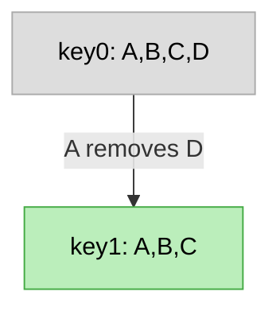
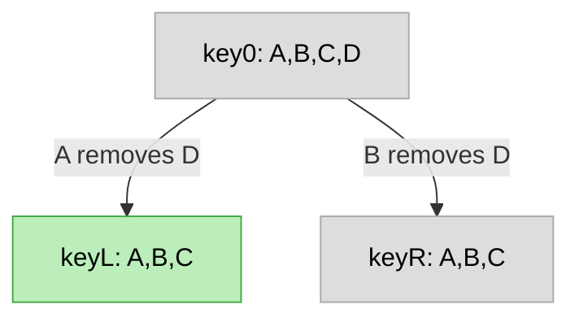
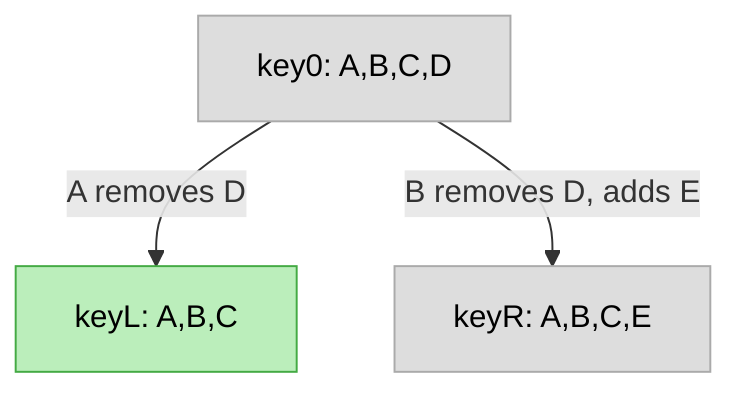
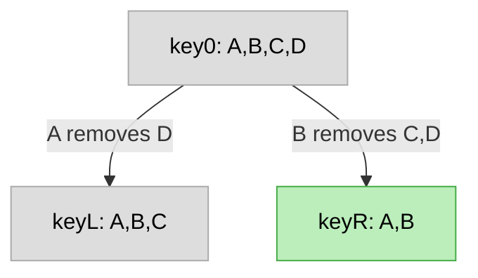
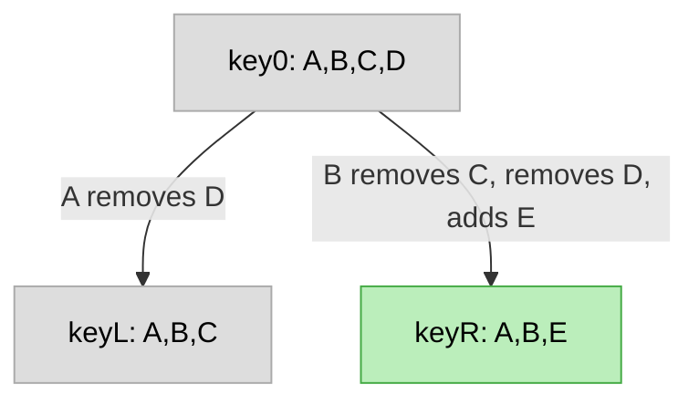
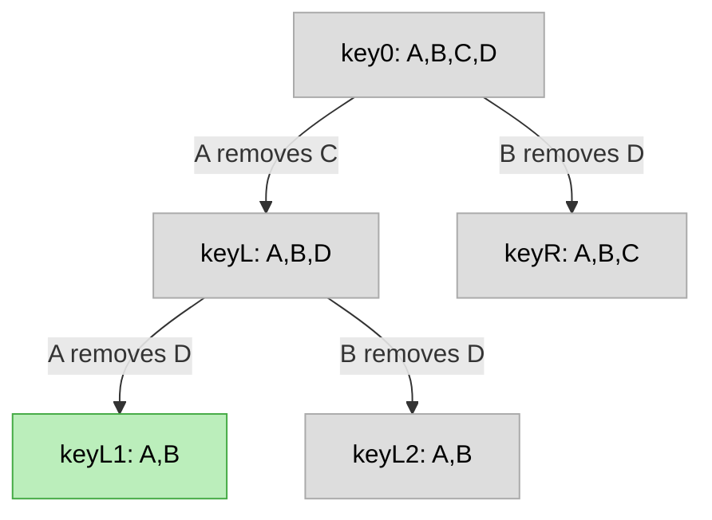
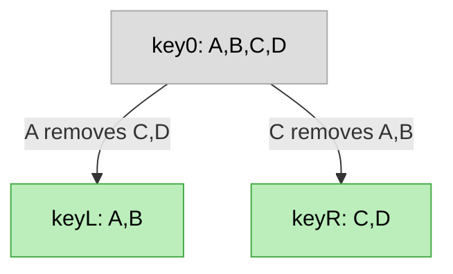
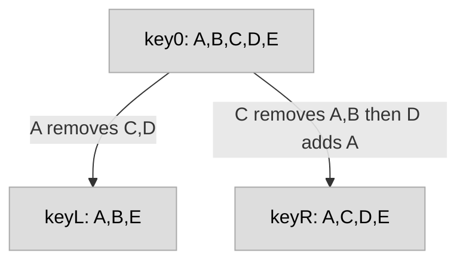

<!--
SPDX-FileCopyrightText: 2023 Andre 'Staltz' Medeiros <contact@staltz.com>

SPDX-License-Identifier: CC-BY-4.0
-->

# ssb-group-exclusion-spec

Version: 0.0

Authors: Mix Irving <mix@protozoa.nz>, Andre Staltz <contact@staltz.com>

License: This work is licensed under a Creative Commons Attribution 4.0
International License.

## Abstract

In this document, we describe how SSB private groups can create the illusion of
group member removal by cycling the symmetric keys in "epochs", thus effectively
excluding a peer from participation in the new epochs.  We also address how to
resolve various cases of diverging epochs, such that group members follow rules
that arrive to consensus on which epoch must new content be published on.

## 1. Introduction

Private groups in SSB are contexts where a set of peers (called "group members"
or "members") use the same symmetric encryption key (called "group key") to
share content with each other privately.  Although adding a peer to the set is a
simple matter of forwarding the symmetric encryption key, removing a peer is
impossible under the assumptions we operate with.

The naive solution to this problem is for some group member to create a new
group key (called the "epoch key") and to share it with all the existing members
except with the undesired member(s).  From this point onwards, all
remaining members who have received the epoch key will proceed to encrypt new
content using the epoch key, effectively excluding the undesired member(s) from
decrypting that.  This is why we call this procedure "group member exclusion",
preventing them from entering new epochs, not "group member removal".  This has
the downside of requiring `O(remaining members)` direct messages to be
published, but is otherwise good for its simplicity.  We assume that member
exclusion is not as frequently occurring as member addition, so the downside is
a reasonable cost to pay.

Since SSB is an eventually consistent network where peers may have different
views on the current state of data structures, the naive solution can give rise
to multiple epochs.  This is undesired, because the goal of private groups is to
create a single context, not multiple contexts, where the set of peers can
participate in.  This document describes a few rules to resolve cases of
diverging epochs, with the goal of allowing remaining group members to
deterministically arrive at a single epoch, given eventual consistency of
propagated SSB messages.

## 2. Terminology

The key words "MUST", "MUST NOT", "REQUIRED", "SHALL", "SHALL NOT", "SHOULD",
"SHOULD NOT", "RECOMMENDED", "MAY", and "OPTIONAL" in this document are to be
interpreted as described in [RFC 2119](https://tools.ietf.org/html/rfc2119).

## 3. Definitions

A set of SSB peers that possess the same [envelope-spec] symmetric encryption
key (called "group key") is called a "private group".  Each peer in a group is
called a "group member" or "member".  The "declared members" of a group is
the set of SSB peers who received the group key via `group/add-member` messages.

When a new group key is created and shared to a subset of members excluding some
other members, that group key is called an "epoch key", and the private group is
called an "epoch".  The act of creating an epoch is called "group member
exclusion" or "exclusion".  The group members who receive the "epoch key" are
called "remaining members".

We say that the original group (say `G`) "directly preceded" the epoch (say
`H`), and `H` "directly succeeded" `G`.  There may be a new epoch `I` excluding
a member from `H`, in which case the `I` directly succeeded `H` but `I`
"succeeded" `G`.  Similarly, `G` "preceded" `I`.  A sequence of epochs up until
the original group is called a "precedence chain".

Whenever there are two epochs such that one of them is not preceded by the
other, and both of them are not succeeded by any epoch, we call this situation
"forked epochs".  A "common predecessor" of two epochs `G` and `H` is any group
or epoch `X` that precedes (or is equal to) `G` and `H`.  The "nearest common
predecessor" `X` of epochs `G` and `H` is the only common predecessor of `G`
and `H` such that no other common predecessor `Y` (of `G` and `H`) succeeds `X`.

In a situation of forked epochs `G` and `H`, assume that `X` is the nearest
common predecessor.  We say that the "common members" of epoch `G` is the
intersection of the declared members of `G` with the declared members of `X`.

## 4. Functional Specification

Exclusion of a group member is a mechanism in which a new epoch is created, such
that the excluded member is allowed to continue publishing messages for the
original group.  However, the excluded member's messages have no guarantee of
being replicated by remaining members, because those remaining members have
transitioned to the new epoch and ceased replication of the former group.  This
in effect only excludes the excluded member from participating in *future* group
discussions.

Creation of epochs is not restricted to any specific member and, in the presence
of network partitions, this allows multiple new epochs created by different
group members.  While the original group guaranteed a singleton context, when
there are multiple epochs there are multiple contexts where discussions can be
held, which is an undesirable property, i.e. forked epochs.  In this section we
provide some rules that remaining group members can follow to "resolve" forked
epochs and arrive at a common epoch as the new singleton context.

### 5.1. Excluding a group member

Suppose there is a private group or epoch `G`.  To exclude a group member `C`,
some group member `A` (`A` is not `C`) publishes the root message of a new epoch
`H` with pointers to `G`, and then publishes SSB message(s) encrypted to the
remaining members (all group `G` members except `C`), announcing the epoch key
and other epoch metadata.  To achieve this, member `A`:

* 5.1.1. MUST create a new symmetric group key (also known as the epoch key)
which MUST have at least 32 bytes of cryptographically secure random data
* 5.1.2. MUST create a new group feed (also known as the "epoch feed") using the
epoch key, as described in [ssb-meta-feeds-group-spec] Section 3.2
* 5.1.3. MUST publish a `group/init` message on the epoch feed, as described in
the [private-group-spec], with the exception that:
  * 5.1.3.A. the `tangles.group.previous` field MUST be the group `G`'s ID, and
  * 5.1.3.B. if `G` is also an epoch of another group, `tangles.group.root` MUST
  be the group ID for the first group (which is not an epoch of any other in
  this chain of epochs), otherwise
  * 5.1.3.C. if `G` is not an epoch of any other group, `tangles.group.root`
  MUST be group `G`'s ID
* 5.1.4. SHOULD publish a `group/exclude` message on their group feed for `G`
that points to `C`'s group feed for `G`. :fire: TODO more details
* 5.1.5. MUST publish a `group/add-member` message on their group feed for `G`,
to add remaining group members (this includes `A`, for recovery purposes) to the
epoch, such that the message schema is the same as the one in
[ssb-meta-feeds-group-spec] Section 3.1
  * 5.1.5.A. If a single SSB message cannot, due to message size
  restrictions, contain all remaining members as recipients, then member `A`
  MUST publish on their group feed for `G` a sequence of `group/add-members`
  according to [ssb-meta-feeds-group-spec] Section 3.1, such that the union of
  all recipients in that sequence equals all remaining group members

Concerning replication of group feeds, all remaining group members SHOULD cease
to replicate `C`'s group feed for `G` as soon as the `group/exclude` message
is replicated.  Remaining group members MAY also cease to replicate every
member's group feed for `G` when `group/exclude` is replicated, although this
can have a negative impact on eventual consistency, because group members may
receive the `group/exclude` message at different times, and in this transition
period there may have been useful content published on group feeds for `G`.

### 5.2. Resolving forked epochs with same membership

Suppose there are two forked epochs `L` and `R`, their nearest
common predecessor is `X`, and `L`'s epoch key encoded in hexadecimal is
lexicographically less than `R`'s epoch key encoded in hexadecimal. :fire: IS
THIS OUR DETERMINISTIC RULE?

If the common members of `L` are equal to the common members of `R`, then all
members of `L` and all the members of `R` who detect the existence of `L` and
`R` MUST select `L` as the resolved epoch, meaning that they SHOULD cease
publishing messages to `R` and SHOULD publish new messages only on epoch `L`.

### 5.3. Resolving forked epochs with subset membership

Suppose there are two forked epochs `L` and `R`, their nearest common
predecessor is `X`.

If the common members of `L` are a proper subset of the common members of `R`,
then all members of `L` and all the members of `R` who detect the existence of
`L` and `R` MUST select `L` as the resolved epoch, meaning that they SHOULD
cease publishing messages to `R` and SHOULD publish new messages only on epoch
`L`.

### 5.4. Resolving forked epochs with overlapping membership

Suppose there are two forked epochs `L` and `R`, their nearest
common predecessor is `X`, and `L`'s epoch key encoded in hexadecimal is
lexicographically less than `R`'s epoch key encoded in hexadecimal. :fire: IS
THIS OUR DETERMINISTIC RULE?

If the symmetric difference of the common members of `L` and the common members
of `R` is not empty, then any peer in the intersection of `L`'s common members
and `R`'s common members SHOULD create a new epoch succeeded `L`, excluding all
peers in `L`'s common members minus `R`'s common members.

It is RECOMMENDED that a peer waits a random amount of time before performing
the exclusion, to give opportunity for some other peer to perform the exclusion
first.  If a peer in the intersection of `L`'s common members and `R`'s common
members detects a new epoch based on `L`, then this peer MUST NOT perform the
exclusion, but SHOULD adopt the newly detected epoch to publish new group
messages.

### 5.5. Forked epochs with disjoint membership

<!-- FIXME: -->

## 4. Examples

### 4.1. Excluding a group member (new epoch)

### 4.2. Resolving forks with same membership (selection)

AND

### 4.3. Resolving forks with subset membership (selection)

AND

### 4.4. Resolving forks with non-subset membership (new epoch)

### 4.5. Resolving forks with disjoint membership (do nothing)

AND

<!-- FIXME: a section for each case, mermaid diagrams -->

## 5. Security Considerations

<!-- FIXME: -->

## 6. References

### 6.1. Normative References

- [ssb-meta-feeds-spec] version 1.0
- [ssb-meta-feeds-group-spec] version 1.0
- [envelope-spec] version 1.0.0
- [private-group-spec] version 2.0.0
- [ssb-meta-feeds-dm-spec] version 0.1

### 6.2. Informative References

- [private-groups-original-notes]
- [scuttlebutt-protocol-guide]
- [ssb-private-group-keys]
- [ssb-tribes2]
- [ssb-meta-feeds]
- [perfect-forward-secrecy]
- [post-compromise-security]

<!-- References -->

[private-group-spec]: https://github.com/ssbc/private-group-spec
[ssb-meta-feeds-spec]: https://github.com/ssbc/ssb-meta-feeds-spec
[ssb-meta-feeds-group-spec]: https://github.com/ssbc/ssb-meta-feeds-group-spec
[envelope-spec]: https://github.com/ssbc/envelope-spec/
[ssb-meta-feeds-dm-spec]: https://github.com/ssbc/ssb-meta-feeds-dm-spec
[scuttlebutt-protocol-guide]: https://ssbc.github.io/scuttlebutt-protocol-guide/
[ssb-private-group-keys]: https://github.com/ssbc/ssb-private-group-keys
[ssb-tribes2]: https://github.com/ssbc/ssb-tribes2
[ssb-meta-feeds]: https://github.com/ssbc/ssb-meta-feeds
[private-groups-original-notes]: https://github.com/ssbc/envelope-spec/blob/master/original_notes.md
[perfect-forward-secrecy]: https://en.wikipedia.org/wiki/Forward_secrecy
[post-compromise-security]: https://ieeexplore.ieee.org/document/7536374
[ssb-uri-spec]: https://github.com/ssbc/ssb-uri-spec
