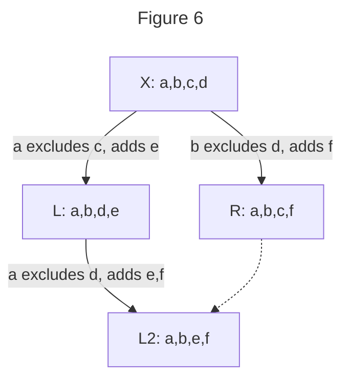

<!--
SPDX-FileCopyrightText: 2023 Andre 'Staltz' Medeiros <contact@staltz.com>

SPDX-License-Identifier: CC-BY-4.0
-->

# ssb-group-exclusion-spec

Version: 0.0

Authors: Mix Irving <mix@protozoa.nz>, Andre Staltz <contact@staltz.com>

License: This work is licensed under a Creative Commons Attribution 4.0
International License.


## Abstract

In this document, we describe how SSB private groups can create the illusion of
group member removal by cycling the symmetric keys in "epochs", thus effectively
excluding a peer from participation in the new epochs.  We also address how to
resolve various cases of diverging epochs, such that group members follow rules
that arrive to consensus on which epoch must new content be published on.


## 1. Introduction

Private groups in SSB are contexts where a set of peers (called "group members"
or "members") use the same symmetric encryption key (called "group key") to
share content with each other privately.  Although adding a peer to the set is a
simple matter of forwarding the symmetric encryption key, removing a peer is
impossible under the assumptions we operate with.

The naive solution to this problem is for some group member to create a new
group key (called the "epoch key") and to share it with all the existing members
except with the undesired member(s).  From this point onwards, all
remaining members who have received the epoch key will proceed to encrypt new
content using the epoch key, effectively excluding the undesired member(s) from
decrypting that.  This is why we call this procedure "group member exclusion",
preventing them from entering new epochs, not "group member removal".  This has
the downside of requiring `O(remaining members)` direct messages to be
published, but is otherwise good for its simplicity.  We assume that member
exclusion is not as frequently occurring as member addition, so the downside is
a reasonable cost to pay.

Since SSB is an eventually consistent network where peers may have different
views on the current state of data structures, the naive solution can give rise
to multiple epochs.  This is undesired, because the goal of private groups is to
create a single context, not multiple contexts, where the set of peers can
participate in.  This document describes a few rules to resolve cases of
diverging epochs, with the goal of allowing remaining group members to
deterministically arrive at a single epoch, given eventual consistency of
propagated SSB messages.


## 2. Terminology

The key words "MUST", "MUST NOT", "REQUIRED", "SHALL", "SHALL NOT", "SHOULD",
"SHOULD NOT", "RECOMMENDED", "MAY", and "OPTIONAL" in this document are to be
interpreted as described in [RFC 2119](https://tools.ietf.org/html/rfc2119).


## 3. Definitions and notations

The following words and phrases are commonly used throughout this document.
They are listed here with their intended meaning for the convenience of the
reader.

Private group and membership:

* A set of SSB peers that possess the same [envelope-spec] symmetric encryption
key (called "group key") is called a "private group".  Each peer in a group is
called a "group member" or "member".  The "declared members" of a group is
the set of SSB peers who received the group key via `group/add-member` messages.
We also denote the declared members of a group `G` as the mathematical set
`members(G)`.

Epoch:

* When a new group key is created and shared to a subset of members excluding
some other members, that group key is called an "epoch key", and the private
group is called an "epoch".  The act of creating an epoch is called "group member
exclusion" or "exclusion".  The group members who receive the "epoch key" are
called "remaining members".  We can also say that the original private group is
the "epoch zero", hence we shall use the term "epoch" in this document whenever
we mean either the original private group or subsequent epochs.

Precedence:

* We say that `G` "directly preceded" epoch `H` if `H` was created by excluding
some member from `G`, and `H` "directly succeeded" `G`.  There may be a new
epoch `I` excluding a member from `H`, in which case the `I` directly succeeded
`H` but `I` "succeeded" `G`.  Similarly, `G` "preceded" `I`.  A sequence of
epochs up until epoch zero is called a "precedence chain".

Preference:

* Epoch `H` is said to be "preferred over" epoch `G` if `H` is where new
discussions should take place among the remaining members.

Forked epochs:

* Whenever there are two epochs such that one of them is not preceded by the
other, and both of them are not succeeded by any epoch, we call this situation
"forked epochs".

Common predecessors:

* A "common predecessor" of two epochs `G` and `H` is any epoch `X` that
precedes (or is equal to) `G` and `H`.  The "nearest common predecessor" `X` of
epochs `G` and `H` is the only common predecessor of `G` and `H` such that no
other common predecessor `Y` (of `G` and `H`) succeeds `X`.  We also denote it
as `X = nearest(G, H)`.

Fork witnesses

* In a situation of forked epochs `G` and `H`, assume that `X` is the nearest
common predecessor.  We say that the "fork witnesses" of epochs `G` and `H` is
the interestion of the members of `G`, `H`, and `X`:

```
forkWitness(G,H) = members(G) ∩ members(H) ∩ members(nearest(G,H))
                 = members(G) ∩ members(H) ∩ members(X)
```

Some mathematical set relations will be useful throughout this specification.
For two sets `A` and `B`, we use the notation:

* `A = B` : `A` is equivalent to `B`
* `A ⊂ B` : `A` is a [proper subset] of `B` ("A is a [susbet] of B, AND A is NOT equivalent to B")
* `A ∩ B` : the [intersection] of `A` and `B` (the set of elements in both `A` AND `B`)
* `A ∪ B` : the [union] of `A` and `B` (the set of elements in `A` AND/OR `B`)
* `A \ B` : the [set difference] of `A` and `B` (the set of elements in `A` but not in `B`)
* `∅` : the "empty set" (the set which has no elements)


## 4. Functional Specification

Exclusion of a group member is a mechanism in which a new epoch is created, such
that the excluded member is allowed to continue publishing messages for the
former epoch.  However, the excluded member's messages have no guarantee of
being replicated by remaining members, because those remaining members have
transitioned to the new epoch and ceased replication of the former epoch.  This
in effect only excludes the excluded member from participating in *future* group
discussions.

Creation of epochs is not restricted to any specific member and, in the presence
of network partitions, this allows multiple new epochs created by different
group members.  While epoch zero guaranteed a singleton context, when there are
multiple epochs there are multiple contexts where discussions can be held, which
is an undesirable property, i.e. forked epochs.  In this section we provide some
rules that remaining members can follow to "resolve" forked epochs and
arrive at a common epoch as the new singleton context.


### 4.1. Excluding a member

Suppose there is an epoch `G`.  To exclude a member `c` from `G`, some member
`a` (who MUST NOT be `c`) publishes to epoch `G` that `c` will be excluded,
creates a new epoch `H`, and adds all declared group members of `G` minus `c` as
the members of `H`. See figure 1 as an example, and the following subsections
for details.


Let `Ga` be `a`'s subfeed dedicated for publishing messages for epoch `G`.  To
perform member exclusion, the following steps SHOULD be taken in order:

* 4.1.1. `a` MUST create a new symmetric group key `H` (also known as the epoch
key) which MUST have at least 32 bytes of cryptographically secure random data
* 4.1.2. `a` MUST create a new group feed `Ha` (also known as the "epoch feed")
using the epoch key as the `feedpurpose`, as described in [ssb-meta-feeds-group-spec]
Section 3.2.2.
* 4.1.3. `a` MUST publish a `group/init` message on `Ha`, as described in the
[private-group-spec]
* 4.1.4. `a` SHOULD publish an encrypted `group/exclude` message on `Ga` with
the following fields in the message `content`:
  * 4.1.4.A. `type` equals the string `group/exclude`
  * 4.1.4.B. `excludes` is an array of group member IDs (their root metafeed
  IDs) excluded from `G`.  In this case `c` is the only excluded member, but
  Section 4.1. supports excluding multiple members at once.
  * 4.1.4.C. `recps` is an array containing a single string: the group ID for
  `G`, signalling that this message should be box2-encrypted for the group `G`
* 4.1.5. `a` MUST publish a `group/add-member` message on `Ga`, to add remaining
group members (this includes `a`, for recovery purposes) to the epoch `H`, such
that the message schema is the same as the one in [ssb-meta-feeds-group-spec]
Section 3.1 with the following exceptions:
  * 4.1.5.A. If a single SSB message cannot, due to message size
  restrictions, contain all remaining members as recipients, then member `a`
  MUST publish on `Ga` a sequence of `group/add-members` messages according to
  [ssb-meta-feeds-group-spec] Section 3.1, such that the union of all recipients
  in that sequence equals all remaining members

It is RECOMMENDED that epoch `G` is the "most preferred epoch" among all the
epochs that `a` is a member of, which succeed a certain epoch zero.


### 4.2. Preferring the next epoch

When a member `a` of an epoch `G` replicates and decrypts a `group/add-member`
message that adds `a` to the new epoch `H` (in other words, `a` "detected the
existence" of `H`), then `a` MUST select epoch `H` as "preferred" over `G`.

Said differently, if `H` directly succeeds `G`, then `H` MUST be preferred over
`G`.

The implications of determining the "preferred epochs" will be addressed in
section 4.8.


### 4.3. Tie-breaking rule

In some cases, there may be multiple forked epochs that "tie" as the preferred
epoch.  We define a tie-breaking rule that allows all remaining members to
deterministically choose one of those tied epochs as the preferred epoch.  This
rule will be used in sections 4.4. and 4.6.

The tie-breaking rule is: among the forked epochs, sort their epoch keys by
lexicographic order (in hexadecimal encoding) and the epoch with the smallest
epoch key is considered the winner.


### 4.4. Resolving forked epochs with same membership

Suppose there are two forked epochs `L` and `R`, and `L`'s epoch key is the
winner according to the tie-breaking rule (section 4.3.).

If `members(L) = members(R)`, then all peers who detect the existence of both
`L` and `R` MUST select `L` as the preferred epoch (determined by the tie-
breaking rule) over `R`. See figure 2.


Here we addressed two forked epochs.  In the generalized case where two or more
forked epochs have the same membership, then the tie-breaking rule (section 4.3.)
is used to select the preferred epoch.  The tie-breaking rule supports multiple
inputs.

### 4.5. Resolving forked epochs with subset membership

Suppose there are two forked epochs `L` and `R`.  If `members(L) ⊂ members(R)`,
then all fork witnesses `forkWitness(L,R)` who detect the existence of both `L`
and `R` MUST select `L` as the preferred epoch over `R`. See figure 3.


Further, if a member `b` in `R` adds a new member `e` to `R`, then `b` MUST
add `e` to `L` as soon as `b` detects the existence of `L` (figure 4).


These members can be calculated as:
```
toAdd = members(R) \ members(X)
```

### 4.6. Resolving forked epochs with overlapping membership

Suppose there are two forked epochs `L` and `R`, and `L`'s epoch key is the
winner according to the tie-breaking rule (section 4.3.).

If `L` and `R` are neither equivalent, nor subsets, but there is overlapping
membership i.e. the intersection is not the empty set

```
members(L) ∩ members(R) ≠ ∅ 
```

then any member in `forkWitness(L,R)` SHOULD create a new epoch directly 
succeeding `L`, excluding all peers that were excluded in `R`. See figure 5.


It is RECOMMENDED that a peer waits a random amount of time before performing
the exclusion, to give opportunity for some other peer to perform the exclusion
first.  If a peer in `witnessFork(L,R)` detects a new epoch `L2`
directly succeeding `L`, then this peer MUST NOT perform the exclusion, but
SHOULD select `L2` as preferred over `L`.

However, it is possible that two or more peers perform exclusions, which leads
to forked epochs with the same membership, where the rules from section 4.4.
would apply in order to resolve that situation.

In the case that there have been new additions to each epoch, we ensure that 
those are conserved in the final preferred epoch. In the example in figure 6, `e`
has been added to `L`, and `f` has been added to `R`, so these two will be added
to the final preferred epoch `L2`



You can calculate who should be in the final preferred epoch as:

```
L2 = (the witnesses to the fork) U (the new people added)
   = (members(L) ∩ members(R) ∩ members(X)) ∪ ((members(L) ∪ members(R)) \ members(X))
   = [a,b] ∪ [e,f]
   = [a,b,e,f]
```

### 4.7. Forked epochs with disjoint membership

Suppose there are two forked epochs `L` and `R`.  If there are no witnesses of the
fork, i.e. `forkWitness(L,R) = ∅`, then nothing needs to be performed in this situation,
because the forked epochs represent two disjoint contexts.  From the perspective
of peers in `members(L)`, epoch `R` does not exist, and from the perspective of peers in
`members(R)`, epoch `L` does not exist. See figure 7.


However, if a member is added to `L` or `R` such that the  `forkWitness(L,R)` would 
be non-empty, then the rules in sections 4.4. or 4.5. or 4.6. would apply. See figure 8.


### 4.8. Most preferred epoch

Given the rules in sections 4.2.–4.7. defining which epoch is preferred, a
directed acyclic graph of preference arises, allowing us to determining the
"most preferred epoch".  Each group member has their own definition of most
preferred epoch, and they are not necessarily the same.  For instance, in the
case of forked epochs with disjoint memberships (4.7.), the members of the two
disjoint epochs select different most preferred epochs.

The "other epochs" are all the epochs that succeed epoch zero, except the most
preferred epoch.


### 4.8.1. Publishing messages

Once a peer has discovered their most preferred epoch `H`, they SHOULD cease
publishing SSB messages on other epochs, and SHOULD publish new messages only on
epoch `H`, until the moment when their most preferred epoch changes.


### 4.8.2. Replicating other epochs

Assume that replicating an SSB feed involves two operations: "fetching" new
updates (new messages published) from that feed, and "serving" any messages in
that feed to an interested peer.

As soon as a peer `a` has discovered their most preferred epoch `H`:

* 4.8.2.A. `a` SHOULD cease fetching messages from group feeds of other epochs
`X` belonging to a member that was excluded from `X`, but should continue to
fetch messages from group feeds belonging to any remaining member of `X`. See
figure 8 as an example.
* 4.8.2.B. `a` SHOULD continue to serve messages from group feeds of any epoch
`X` belonging to **any** member of `X`.


## 5. Security and Privacy Considerations


### 5.1. Excluded members can read old messages

An excluded member can still read and preserve all of the messages up until the
point they were excluded, and this could be used maliciously to extract as much
information from other group members as possible, for instance by analysing the
timestamps of messages published to the group and deriving suitable timezones
for each peer.


### 5.2. Weak tie-breaking rule

The tie-breaking rule is simple and easy to implement, but it can be gamed such
that a malicious group member can force their forked epoch to be preferred over
others.  This can be achieved by brute-forcing the epoch ID until it is
lexicographically "small" (such as starting with the character `0`).  It is
currently unknown how this weakness can be exploited to degrade security or
privacy, but at the very least it reduces fairness and randomness in choosing
preferred epochs.

A better tie-breaking rule would have the property that gives each
epoch-creating peer no information on how "strong" their epoch key in winning
a tie-break.  However, we also require tie-breaking rules to be deterministic,
and to create a total order between a set of forked epochs, because we need
group members to eventually converge on a single most preferred epoch.  We have
not found a tie-breaking rule with all three properties, so this is future work.


## 6. References

### 6.1. Normative References

- [ssb-meta-feeds-spec] version 1.0
- [ssb-meta-feeds-group-spec] version 1.0
- [envelope-spec] version 1.0.0
- [private-group-spec] version 2.0.0
- [ssb-meta-feeds-dm-spec] version 0.1

### 6.2. Informative References

- [private-groups-original-notes]
- [scuttlebutt-protocol-guide]
- [ssb-private-group-keys]
- [ssb-tribes2]
- [ssb-meta-feeds]
- [perfect-forward-secrecy]
- [post-compromise-security]

<!-- References -->

[private-group-spec]: https://github.com/ssbc/private-group-spec
[ssb-meta-feeds-spec]: https://github.com/ssbc/ssb-meta-feeds-spec
[ssb-meta-feeds-group-spec]: https://github.com/ssbc/ssb-meta-feeds-group-spec
[envelope-spec]: https://github.com/ssbc/envelope-spec/
[ssb-meta-feeds-dm-spec]: https://github.com/ssbc/ssb-meta-feeds-dm-spec
[scuttlebutt-protocol-guide]: https://ssbc.github.io/scuttlebutt-protocol-guide/
[ssb-private-group-keys]: https://github.com/ssbc/ssb-private-group-keys
[ssb-tribes2]: https://github.com/ssbc/ssb-tribes2
[ssb-meta-feeds]: https://github.com/ssbc/ssb-meta-feeds
[private-groups-original-notes]: https://github.com/ssbc/envelope-spec/blob/master/original_notes.md
[perfect-forward-secrecy]: https://en.wikipedia.org/wiki/Forward_secrecy
[post-compromise-security]: https://ieeexplore.ieee.org/document/7536374
[ssb-uri-spec]: https://github.com/ssbc/ssb-uri-spec

[subset]: https://en.wikipedia.org/wiki/Subset
[proper subset]: https://en.wikipedia.org/wiki/Subset
[union]: https://en.wikipedia.org/wiki/Union_(set_theory)
[intersection]: https://en.wikipedia.org/wiki/Intersection_(set_theory)
[set difference]: https://en.wikipedia.org/wiki/Complement_(set_theory)#Relative_complement
